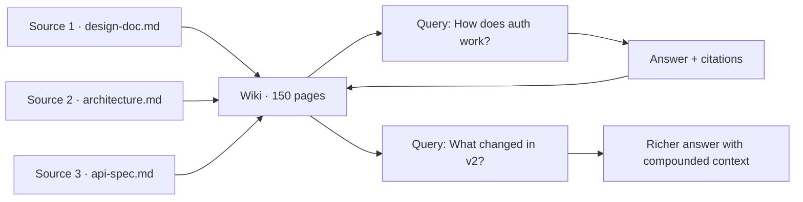

# The LLM Wiki Pattern

Docuflow implements the **LLM Wiki pattern** — a methodology for building persistent, incrementally-maintained knowledge bases using language models.

## The problem with RAG

Standard RAG (Retrieval-Augmented Generation) systems re-discover knowledge on every query:

```
Query 1:  Read sources → chunk → embed → retrieve → generate answer → (answer lost)
Query 2:  Read sources → chunk → embed → retrieve → generate answer → (answer lost)
Query N:  Same process. No compounding. No accumulation.
```

This means:
- Re-processing the same documents repeatedly
- No improvement over time — query 100 is no better than query 1
- Context lost between sessions
- Expensive and slow for large codebases

## The LLM Wiki solution

Instead of re-extracting, Docuflow builds a persistent wiki that compounds:

```
Source added → LLM reads once → extracts entities, concepts, relationships
                              → writes wiki pages with context
                              → cross-references existing pages
                              → updates index

Query later  → search wiki (not raw sources)
             → answer is better because wiki is richer
             → answer saved as new page
             → next query benefits from this synthesis too
```

**The key insight:** The LLM does the bookkeeping once. That work reuses forever.

## Three-layer architecture

### Layer 1: Raw Sources (immutable)

Your curated documents — code, articles, design docs, meeting notes. Located in `.docuflow/sources/`. The LLM reads but never modifies these. Every source is kept as an audit trail.

### Layer 2: Wiki (LLM-maintained)

Structured markdown pages organised by category:

| Category | What it holds |
|----------|--------------|
| `entities/` | Named things — services, APIs, databases, classes |
| `concepts/` | Design patterns, principles, integrations, workflows |
| `timelines/` | Chronological pages — changelogs, release histories |
| `syntheses/` | Cross-cutting synthesis pages — answers promoted to permanent pages |

The wiki grows incrementally. Cross-references update automatically. Contradictions between sources are noted.

### Layer 3: Schema & metadata (configuration)

- `.docuflow/schema.md` — domain-specific structure and workflows (edit to customise)
- `.docuflow/index.md` — auto-maintained searchable catalog
- `.docuflow/log.md` — append-only operation history

## Knowledge compounding in practice



## Comparison

| | Standard RAG | LLM Wiki Pattern |
|---|---|---|
| Knowledge persists | ❌ No | ✅ Yes |
| Gets better over time | ❌ No | ✅ Yes |
| Re-processes sources | ✅ Every query | ❌ Once on ingest |
| Cross-references | ❌ No | ✅ Automatic |
| Contradiction tracking | ❌ No | ✅ Flagged |
| Session context | ❌ Lost | ✅ Permanent |

## When to use Docuflow

Docuflow is well-suited for:

- **Large codebases** where re-reading all files per query is expensive
- **Long-running projects** where accumulated context is valuable
- **Team knowledge bases** where multiple people contribute sources
- **AI-assisted development** where agents need persistent codebase understanding

It's not optimised for:
- One-off document Q&A (use plain RAG)
- Real-time data (wiki is a snapshot, not a live index)

[Architecture →](architecture.md){ .md-button }
