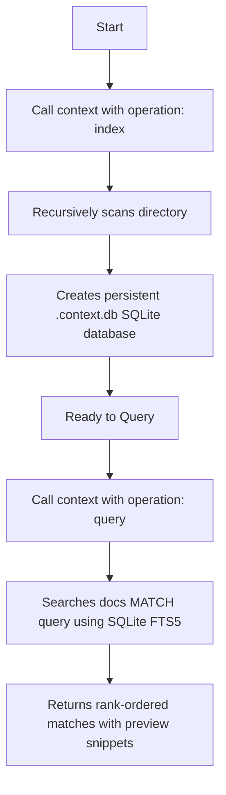

# Context Service

The `context` tool provides a **Context-as-a-Service** persistent index of your files using a local SQLite database with FTS5 (Full-Text Search).

It helps AI agents quickly answer where specific concepts, terms, API endpoints, or configurations are defined in the workspace, bypassing the need to search or read all files.

## Workflow

Using the `context` tool is a two-step process:

1. **`index`**: Scan and index all text files in the directory.
2. **`query`**: Run search queries against the created index to find matching lines and snippets.



## Parameters

| Parameter | Type | Required | Description |
|-----------|------|----------|-------------|
| `directory` | string | ✅ | Absolute path to the directory to index or query. |
| `operation` | string | ❌ | Operation to perform: `"index"` or `"query"` (default: `"query"`). |
| `query` | string | ❌ | The term, phrase, or MATCH expression to search for (required for `"query"`). |

## Usage Examples

### 1. Indexing a directory

To build the SQLite database, specify the `"index"` operation:

```json
{
  "directory": "/path/to/project",
  "operation": "index"
}
```

**Output:**
```json
{
  "message": "Indexed 42 files in '/path/to/project'",
  "status": "success"
}
```

This creates `.context.db` and `.context.db-journal` in the target directory (which should be added to your `.gitignore`).

### 2. Querying the index

Once indexed, search for concepts or terms:

```json
{
  "directory": "/path/to/project",
  "operation": "query",
  "query": "JWT authentication"
}
```

**Output:**
```json
{
  "message": "Found 3 files matching 'JWT authentication' in '/path/to/project'",
  "matches": [
    {
      "path": "/path/to/project/src/auth.ts",
      "snippet": "verify(token, secret); // <b>JWT authentication</b> middleware..."
    }
  ],
  "status": "success"
}
```
