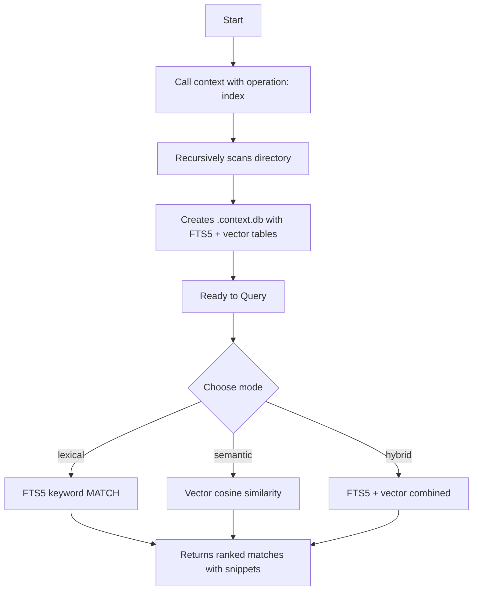

# Context Service

The `context` tool provides a **Context-as-a-Service** persistent index of your files using a local SQLite database. It supports two search strategies:

- **Lexical search** (FTS5) — fast keyword matching via SQLite Full-Text Search.
- **Semantic search** (sqlite-vec + @xenova/transformers) — vector embeddings for meaning-based retrieval.

Both strategies are **local-first** — no cloud API key is required. Embeddings are generated on-device using the `all-MiniLM-L6-v2` model via `@xenova/transformers`.

It helps AI agents quickly answer where specific concepts, terms, API endpoints, or configurations are defined in the workspace, bypassing the need to search or read all files.

## Workflow

Using the `context` tool is a two-step process:

1. **`index`**: Scan and index all text files in the directory. This builds both the FTS5 keyword index and the vector embeddings table.
2. **`query`**: Run search queries against the created index in `lexical`, `semantic`, or `hybrid` mode.



## Parameters

| Parameter | Type | Required | Description |
|-----------|------|----------|-------------|
| `directory` | string | ✅ | Absolute path to the directory to index or query. |
| `operation` | string | ❌ | Operation to perform: `"index"` or `"query"` (default: `"query"`). |
| `query` | string | ❌ | The term, phrase, or MATCH expression to search for (required for `"query"`). |
| `mode` | string | ❌ | Search mode: `"lexical"` (default), `"semantic"`, or `"hybrid"`. See [Search Modes](#search-modes). |

## Search Modes

### `lexical` (default)

FTS5 keyword search. Matches exact terms and phrases against the indexed content. This is the original search mode — fast, deterministic, and requires no embeddings.

### `semantic`

Vector similarity search using cosine distance. The query text is embedded using the same `all-MiniLM-L6-v2` model used at index time, then compared against all stored document embeddings. Returns the 20 nearest neighbours ranked by similarity.

Requires that the `index` operation was run with the embeddings model available (it is bundled with `@xenova/transformers` — no separate install needed). If no vector index exists in the database, returns a clear error asking you to re-index.

### `hybrid`

Combines both strategies: runs the FTS5 keyword search first, then appends semantic results for documents not already found by FTS5. This gives you both exact-match precision and meaning-based recall.

**Graceful fallback:** if the embeddings model is unavailable or the database has no vector index (e.g. it was created by an older version), hybrid mode returns the lexical results with a `warning` field instead of failing. The FTS5 path always works.

## Usage Examples

### 1. Indexing a directory

To build the SQLite database, specify the `"index"` operation. This creates both the FTS5 keyword index and the vector embeddings table in a single pass:

```json
{
  "directory": "/path/to/project",
  "operation": "index"
}
```

**Output:**
```json
{
  "message": "Indexed 42 files in '/path/to/project'",
  "status": "success"
}
```

This creates `.context.db` and `.context.db-journal` in the target directory (which should be added to your `.gitignore`).

If `@xenova/transformers` is unavailable at index time, the index operation still succeeds — it builds the FTS5 index without embeddings and logs a warning. You can re-run `index` later once the model is available to add embeddings.

### 2. Lexical query (default)

Search for exact keyword matches. This is the same behavior as v2.1.0:

```json
{
  "directory": "/path/to/project",
  "operation": "query",
  "query": "JWT authentication"
}
```

**Output:**
```json
{
  "message": "Found 3 files matching 'JWT authentication' in '/path/to/project'",
  "matches": [
    {
      "path": "/path/to/project/src/auth.ts",
      "snippet": "verify(token, secret); // <b>JWT authentication</b> middleware..."
    }
  ],
  "status": "success"
}
```

### 3. Semantic query

Find files by meaning, even when they don't contain the exact search terms:

```json
{
  "directory": "/path/to/project",
  "operation": "query",
  "query": "how does the app verify user identity",
  "mode": "semantic"
}
```

**Output:**
```json
{
  "message": "Found 3 files matching 'how does the app verify user identity' in '/path/to/project'",
  "matches": [
    {
      "path": "/path/to/project/src/auth.ts",
      "snippet": "export function authenticate(user: string, password: string): boolean {\n  const hash = bcrypt.has...",
      "distance": 0.42
    }
  ],
  "status": "success"
}
```

### 4. Hybrid query

Get both keyword-exact and meaning-based results in one call:

```json
{
  "directory": "/path/to/project",
  "operation": "query",
  "query": "database connection",
  "mode": "hybrid"
}
```

If the vector index is missing (e.g. older database), you still get results:

```json
{
  "message": "Found 2 files matching 'database connection' in '/path/to/project'",
  "matches": [ ... ],
  "warning": "No vector index found; returning lexical results only. Re-run 'index' to enable semantic search.",
  "status": "success"
}
```

## Architecture

The `context` tool stores everything in a single `.context.db` SQLite file:

| Table | Engine | Purpose |
|-------|--------|---------|
| `docs` | FTS5 virtual table | Full-text keyword index (path + content) |
| `vec_docs` | vec0 virtual table (sqlite-vec) | 384-dimensional float embeddings |
| `doc_vec_map` | Regular table | Maps FTS5 doc rowids to vector rowids |

Dependencies:

- **`better-sqlite3`** — SQLite driver (used since v2.1.0)
- **`sqlite-vec`** — SQLite extension for vector similarity search
- **`@xenova/transformers`** — local inference of `all-MiniLM-L6-v2` embeddings (no cloud key needed)
```
